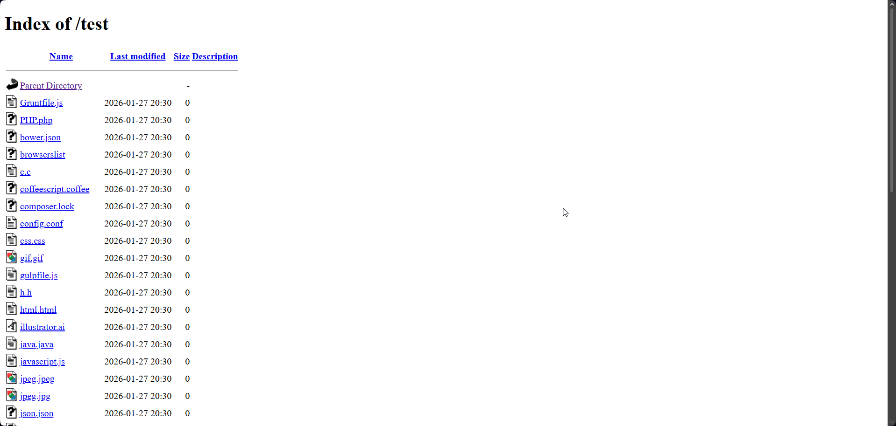
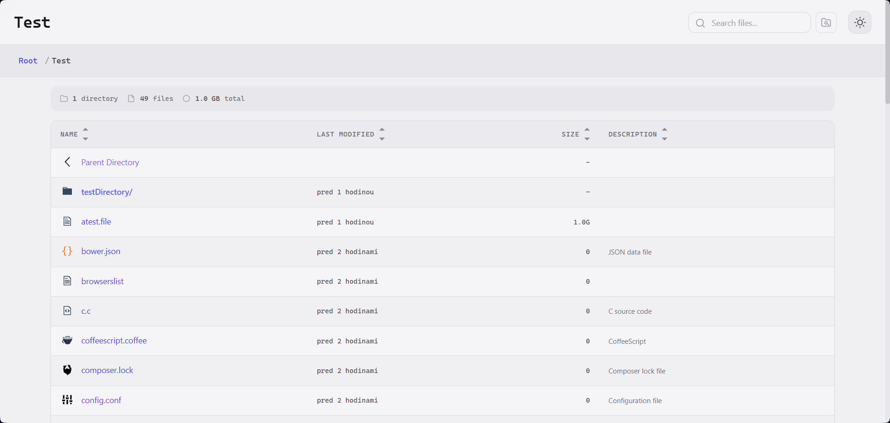
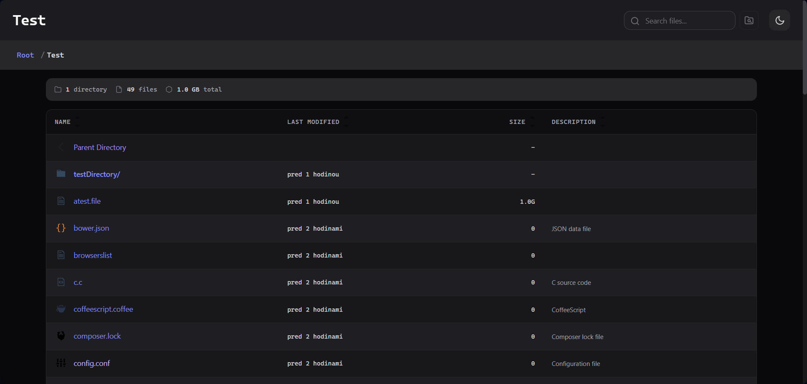

# Fancy Index

[](https://github.com/TheClashFruit/fancyindex-apache)
[](LICENSE)

> **Note:** This is a fork of the original [fancy-index](https://github.com/glen-cheney/fancy-index) by Glen Cheney. This version has been completely modernized with the help of AI to feature a sleek 2026 aesthetic, improved accessibility, and new functionality including:
> - Deep search (recursive search through subdirectories)
> - Light/Dark theme toggle
> - Keyboard navigation
> - Breadcrumb navigation
> - Statistics bar
> - Code-configured plugin system
> - File URL copy actions
> - Browser-generated movie playlists
> - Modern CSS with design tokens

Transform the default Apache directory index from boring and dated to sleek and professional.

## Features

### Design
- **Modern UI** - Clean, minimal futuristic design with CSS custom properties
- **Light/Dark Themes** - Manual toggle with localStorage persistence
- **Responsive** - Works beautifully on desktop, tablet, and mobile
- **High Contrast Support** - WCAG AA compliant accessibility

### Functionality
- **Real-time Search** - Filter files instantly as you type
- **Deep Search** - Recursively search through subdirectories (toggle in search bar)
- **Keyboard Navigation** - Navigate with arrow keys, Enter to open
- **Breadcrumb Navigation** - Easy path traversal
- **Statistics Bar** - Shows file/folder counts and total size
- **Smart Sorting** - Version-aware natural sorting
- **Copy File URL** - Copies the absolute URL for each file to the clipboard
- **Movie Playlists** - Generates and downloads an `.m3u` playlist for movies in the current folder

### Plugins

Plugins are controlled in code and are never exposed as an installation or administration
screen to visitors. Enabled script plugins appear behind the puzzle button beside deep
search. Inline plugins can extend the directory table without appearing in that menu.

The current build includes:

- **Copy file URL** - An inline action with its own table column. It uses the modern
  Clipboard API and a selection-based fallback for older iOS, Android, Windows, and Linux
  browsers.
- **Create movie playlist** - A menu action that collects movie links from the current
  directory and downloads `playlist.m3u` in M3U format. Supported extensions include
  `.avi`, `.flv`, `.m4v`, `.mkv`, `.mov`, `.mp4`, `.mpeg`, `.ts`, `.webm`, and `.wmv`.
- **File size and directory refresh** - Updates sparse-file display using the PHP size
  endpoint and reloads the listing when the Apache directory contents change.

Playlist files are generated entirely in the browser; Apache does not need write access to
the directory. The generated entries use absolute URLs resolved from the current page.

### Plugin directory layout

Each plugin lives in its own directory and contains its implementation alongside any
plugin-specific assets:

```text
plugins/
├── copy-file-url/
│   ├── plugin.js
│   └── plugin.css
├── create-playlist/
│   └── plugin.js
└── file-size-refresh/
    ├── plugin.js
    └── file-size.php
```

The core loader reads `CONFIG.plugins.list`, loads the matching `plugin.js` and optional
`plugin.css`, and initializes each enabled plugin. The plugin list is code-only; visitors
never see which plugin files are installed. Plugins with `listed: false` run automatically
but do not appear in the puzzle-button menu.

### Performance
- **Fast Initial Render** - Critical CSS inlined, deferred JS
- **Graceful Degradation** - Works without JavaScript
- **Large Directory Support** - Optimized for thousands of files
- **Caching Headers** - Assets cached for optimal performance

### Security
- **XSS Protected** - All dynamic content properly escaped
- **Security Headers** - X-Content-Type-Options, X-XSS-Protection
- **Hidden Files** - Sensitive files automatically hidden

## Screenshots

### Default View


### Light View


### Dark Theme


## Installation

### Requirements
- Apache HTTP Server 2.4+
- `mod_autoindex` enabled
- `mod_headers` (optional, for security headers)
- `mod_expires` (optional, for caching)
- `mod_deflate` (optional, for compression)

### Quick Setup

1. **Clone or download** the repository:
   ```bash
   git clone https://github.com/Mazurky/fancy-index.git
   ```

2. **Copy files** to your web root:
   ```bash
   cp -r fancy-index /var/www/html/
   ```

3. **Copy `.htaccess`** to the directory you want to index:
   ```bash
   cp fancy-index/.htaccess /var/www/html/.htaccess
   ```

4. **Ensure Apache allows** `.htaccess` overrides:
   ```apache
   <Directory "/var/www/html">
       AllowOverride All
       Options Indexes FollowSymLinks
       Require all granted
   </Directory>
   ```

5. **Restart Apache**:
   ```bash
   sudo systemctl restart apache2
   ```

## Configuration

### Customizing Hidden Files

Edit the `IndexIgnore` directive in `.htaccess`:

```apache
IndexIgnore .git .svn .DS_Store .htaccess node_modules fancy-index
```

### Changing the Theme

The theme can be changed via:
1. **Manual Toggle** - Click the theme button in the header (persists in localStorage)
2. **Force Theme** - Set `data-theme="light"` or `data-theme="dark"` on `<html>` in header.html

### Customizing Colors

Edit the CSS custom properties in `style.css`:

```css
:root {
  --color-accent-primary: #6366f1;  /* Change primary accent */
  --color-link: #4f46e5;            /* Change link color */
  /* ... */
}
```

### Configuring Features

In `script.js`, modify the `CONFIG` object:

```javascript
const CONFIG = {
  dateFormatOptions: {
    relative: false,  // Set to true for relative dates ("2 hours ago")
    absoluteFallbackDays: 30,  // Show absolute date after this many days
  },
  searchDebounceDelay: 150,  // Search delay in ms
  externalApp: {
    enabled: true,
    url: '/app/',
    name: 'Application',
  },
  plugins: {
    enabled: true,             // Disable all plugin loading and UI when false
    path: '/fancy-index/plugins/',
    list: [
      'copy-file-url',
      'create-playlist',
      'file-size-refresh',
    ],
  },
  directoryRefreshInterval: 5000,
  downloadSizeRefreshInterval: 5000,
  fileSizeEndpoint: '/fancy-index/plugins/file-size-refresh/file-size.php',
  // ...
};
```

Remove a plugin name from `CONFIG.plugins.list` to disable it. Individual plugins can also
set `enabled: false` in their `plugin.js` registration. A plugin with `listed: false`
remains an automatic or inline enhancement and is not shown in the puzzle-button menu.

The file-size plugin requires PHP support and the `file-size.php` endpoint to be executable
by Apache. It validates the same-origin referrer, rejects path traversal, and only reports
files from the directory that initiated the request.

### Custom Icons

Add new icon mappings in `.htaccess`:

```apache
AddIcon /fancy-index/icons/your-icon.svg .yourext
AddDescription "Your file type" .yourext
```

## Keyboard Shortcuts

| Key | Action |
|-----|--------|
| `/` | Focus search |
| `Ctrl+Shift+F` | Toggle deep search |
| `↑` / `k` | Move up |
| `↓` / `j` | Move down |
| `Enter` | Open file/folder |
| `Home` | Go to first item |
| `End` | Go to last item |
| `Escape` | Clear search |
| `Tab` | Exit search to file list |

When the plugin menu is open, `Escape` closes it. The puzzle button shows only plugins that
are enabled in `script.js`.

## Browser Support

- Chrome 90+
- Firefox 88+
- Safari 14+ (including iOS Safari)
- Edge 90+
- Opera 76+

The copy action falls back to a selection-based copy command when `navigator.clipboard` is
not available. Older browsers still receive the Apache directory listing and graceful
degradation without JavaScript enhancements.

## Apache Module Requirements

| Module | Purpose | Required |
|--------|---------|----------|
| `mod_autoindex` | Directory listing | ✅ Yes |
| `mod_headers` | Security headers | ❌ Optional |
| `mod_expires` | Asset caching | ❌ Optional |
| `mod_deflate` | Compression | ❌ Optional |

Enable modules:
```bash
sudo a2enmod autoindex headers expires deflate
sudo systemctl restart apache2
```

## Migrating from v1.x

Version 2.0 is a complete rewrite. Key changes:

1. **CSS Variables** - All colors now use CSS custom properties
2. **Theme System** - New light/dark/auto theme support
3. **Modular JS** - Refactored to use modules and IIFE
4. **New Features** - Breadcrumbs, stats bar, keyboard nav
5. **Better A11y** - ARIA labels, focus states, skip links

To migrate:
1. Backup your custom `.htaccess` icon/description additions
2. Replace all files with v2.0
3. Re-apply your custom additions to the new `.htaccess`

## License

MIT License - see [LICENSE](LICENSE) for details.

## Credits

- Original project by [Glen Cheney](https://github.com/glen-cheney/fancy-index)

---

Made for the Apache community
